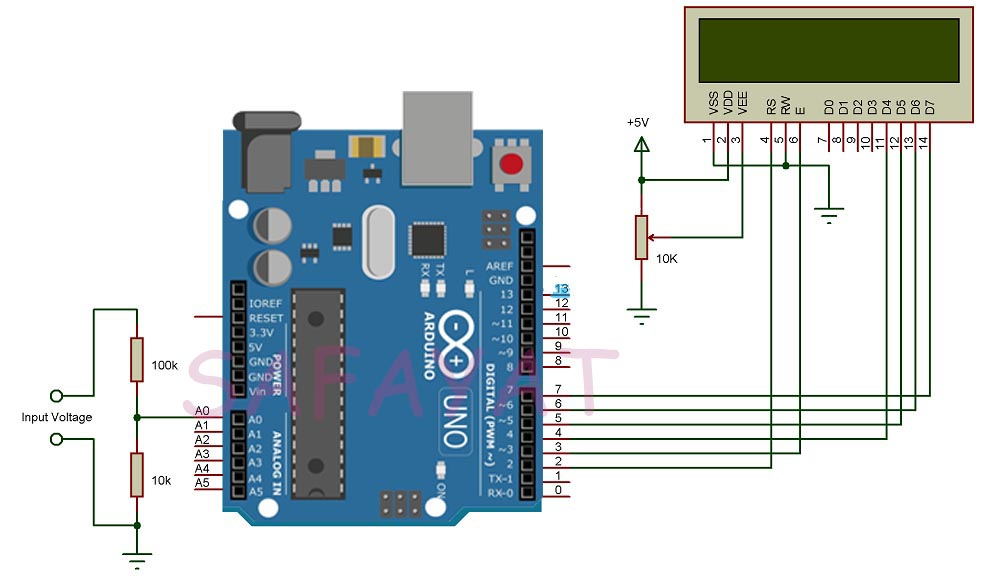

# digital-voltmeter
# Introduction :
Voltmeters are an important piece of equipment which are associated with any kind of electronics project that is used for measuring voltage or potential difference between two points in a circuit.For measuring voltages up to 50V this Arduino based Digital Voltmeter can be used.
# Apparatus : 
* Arduino Uno
* LCD Display 16*2
* Resistors and
* Jumper Wires
# Schematics : 

# Code : 
[Code Link](Digital_voltmeter.ino)
# Working Principle : 
The range of voltages for Arduino UNOs analog input is 0V to 5V. Hence, in order to increase this range, a voltage divider circuit must be used. With the help of the voltage divider circuit, the input voltage being measured is brought down to the range of Arduino UNOs analog input.
# Application : 
* An Arduino based Digital Voltmeter is designed in this project which can be used to measure different ranges of DC voltages.
* The circuit can be extended to measure even AC voltages with slight modification in circuit and code.
